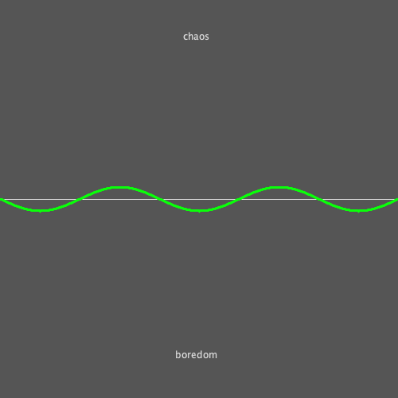
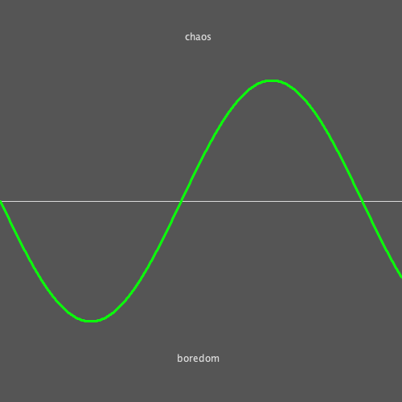

# sine-waves
Small code to generate images for my blog post about checkpoints.  
https://rafael.delboni.cc/#/post/checkpoints

## Run 
```clj
clojure -M -m scratch
```

### This will generate the following images


